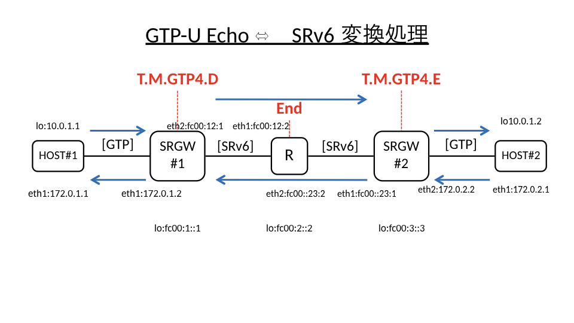

# SRv6-GTP

## Topology


## Run

```bash
$ cd script
$ vagrant up
$ sudo su
./root/scripts/create-namespaces.sh
ip netns exec host1 bash
ping 172.0.2.1

# host1
> Create gtp device
ip netns exec host1 modprobe udp_tunnel
ip netns exec host1 modprobe ip6_udp_tunnel
ip netns exec host1 modprobe gtp
ip netns exec host1 ./gtp-link add gtp1 


> Open a new console and configure tunnel (PDP session)
ip netns exec host1 ./gtp-tunnel add gtp1 v1 200 100 10.0.1.2 172.0.2.1
ip netns exec host1 ip route add 10.0.1.2/32 dev gtp1 

# host2
> Create gtp device 
ip netns exec host2 modprobe udp_tunnel
ip netns exec host2 modprobe ip6_udp_tunnel
ip netns exec host2 modprobe gtp
ip netns exec host2 ./gtp-link add gtp2 

> Open a new console and configure tunnel (PDP session) 
ip netns exec host2 ./gtp-tunnel add gtp2 v1 100 200 10.0.1.1 172.0.1.1 
ip netns exec host2 ip route add 10.0.1.1/32 dev gtp2
```

## xdpcap

See https://github.com/cloudflare/xdpcap

### install
```
cd include
wget https://raw.githubusercontent.com/cloudflare/xdpcap/master/hook.h
```

```
# run on each nodes
sudo mount bpffs /sys/fs/bpf -t bpf
```

* capture packets

```
xdpcap /sys/fs/bpf/xdpcap_hook "icmp"
```
