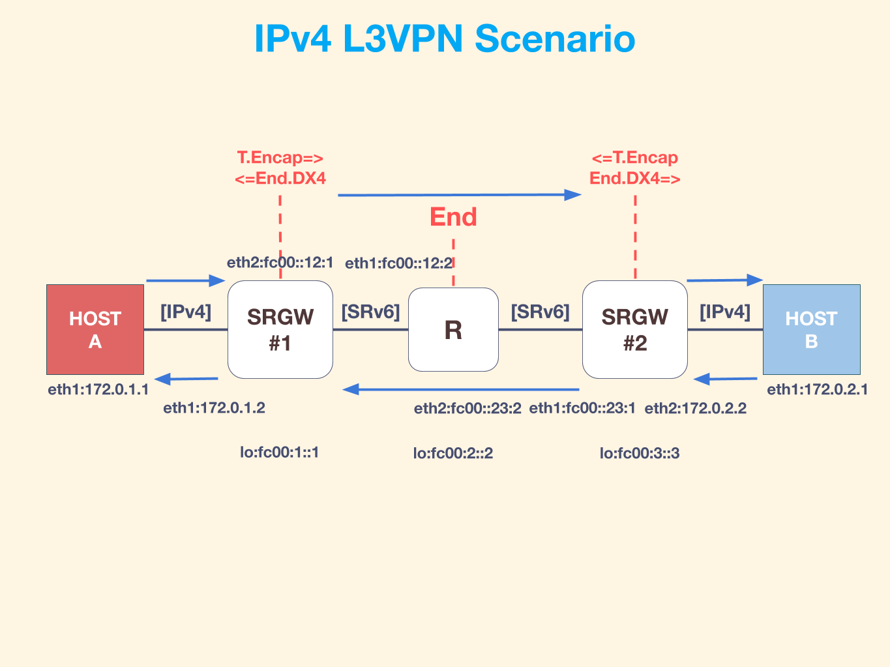

# IPv4 L3VPN

## Subset
* T.Encap
* End.DX4
* End

## Topology


## Config
* gw1
```yaml
internal:
  # logfile: "/var/log/vinbero.log"
  logfile: "./vinbero.log"
  development: false
  devices:
    - eth1
    - eth2
settings:
  functions:
    - action: SEG6_LOCAL_ACTION_END_DX4
      triggerAddr: fc00:1::1/128
      nexthop: 172.0.1.1
  transitv4:
    - action: SEG6_IPTUN_MODE_ENCAP
      triggerAddr: 172.0.2.0/24
      actionSrcAddr: fc00:1::1
      segments:
        - fc00:3::3 # last arrive next hop
        - fc00:2::1
```

* router
```yaml
internal:
  logfile: "./vinbero.log"
  development: false
  devices:
    - eth1
    - eth2
settings:
  functions:
    - action: SEG6_LOCAL_ACTION_END
      addr: fc00:2::1/128
    - action: SEG6_LOCAL_ACTION_END
      addr: fc00:2::2/128
```

* gw1
```yaml
internal:
  logfile: "./vinbero.log"
  development: false
  devices:
    - eth1
    - eth2
settings:
  functions:
    - action: SEG6_LOCAL_ACTION_END_M_GTP4_E
      triggerAddr: fc00:3::/48
      actionSrcAddr: 172.0.2.2
      v4AddrSPos: 64
      v4AddrDPos: 48
  transitv4:
    - action: SEG6_IPTUN_MODE_ENCAP_H_M_GTP4_D
      triggerAddr: 172.0.1.0/24
      actionSrcAddr: fc00:3::/64
      actionDstAddr: fc00:1::/48 # last arrive next hop
      segments:
        - fc00:2::2
```
