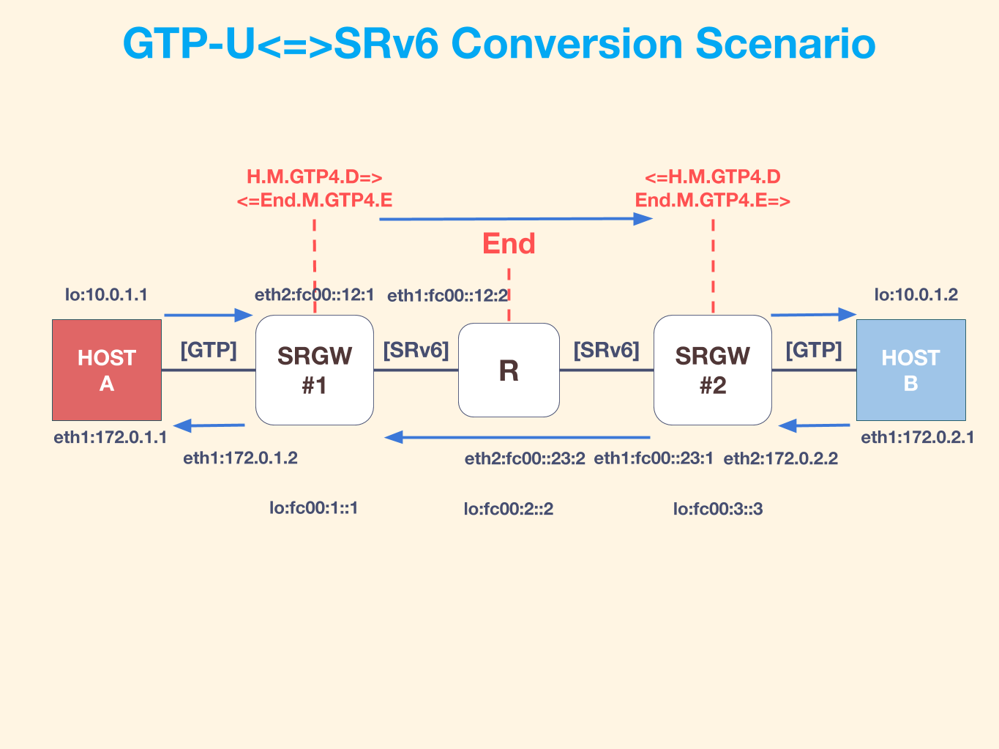

# SRv6/GTPv1 IPv4 Stateless Translation Function

## Subset
* H.M.GTP4.D
* End.M.GTP4.E
* End

## Topology


## GTPv1 Tuunel Setup
```bash
# host1
> Create gtp device
# if failed modprobe, plz new kernel header and module
modprobe udp_tunnel
modprobe ip6_udp_tunnel
modprobe gtp
./gtp-link add gtp1

> Open a new console and configure tunnel (PDP session)
./gtp-tunnel add gtp1 v1 200 100 10.0.1.2 172.0.2.1
ip route add 10.0.1.2/32 dev gtp1
ip link set gtp1 mtu 1500

# host2
> Create gtp device
modprobe udp_tunnel
modprobe ip6_udp_tunnel
modprobe gtp
./gtp-link add gtp2

> Open a new console and configure tunnel (PDP session)
./gtp-tunnel add gtp2 v1 100 200 10.0.1.1 172.0.1.1
ip route add 10.0.1.1/32 dev gtp2
ip link set gtp2 mtu 1500
```

## Config
* gw1
```yaml
internal:
  logfile: "./vinbero.log"
  development: false
  devices:
    - eth1
    - eth2
settings:
  functions:
    - action: SEG6_LOCAL_ACTION_END_M_GTP4_E
      triggerAddr: fc00:1::/48
      actionSrcAddr: 172.0.1.2
      v4AddrSPos: 64
      v4AddrDPos: 48
  transitv4:
    - action: SEG6_IPTUN_MODE_ENCAP_H_M_GTP4_D
      triggerAddr: 172.0.2.0/24
      actionSrcAddr: fc00:1::/64
      actionDstAddr: fc00:3::/48 # last arrive next hop
      segments:
        - fc00:2::1
```

* router
```yaml
internal:
  logfile: "./vinbero.log"
  development: false
  devices:
    - eth1
    - eth2
settings:
  functions:
    - action: SEG6_LOCAL_ACTION_END
      addr: fc00:2::1/128
    - action: SEG6_LOCAL_ACTION_END
      addr: fc00:2::2/128
```

* gw1
```yaml
internal:
  logfile: "./vinbero.log"
  development: false
  devices:
    - eth1
    - eth2
settings:
  functions:
    - action: SEG6_LOCAL_ACTION_END_M_GTP4_E
      triggerAddr: fc00:3::/48
      actionSrcAddr: 172.0.2.2
      v4AddrSPos: 64
      v4AddrDPos: 48
  transitv4:
    - action: SEG6_IPTUN_MODE_ENCAP_H_M_GTP4_D
      triggerAddr: 172.0.1.0/24
      actionSrcAddr: fc00:3::/64
      actionDstAddr: fc00:1::/48 # last arrive next hop
      segments:
        - fc00:2::2
```
