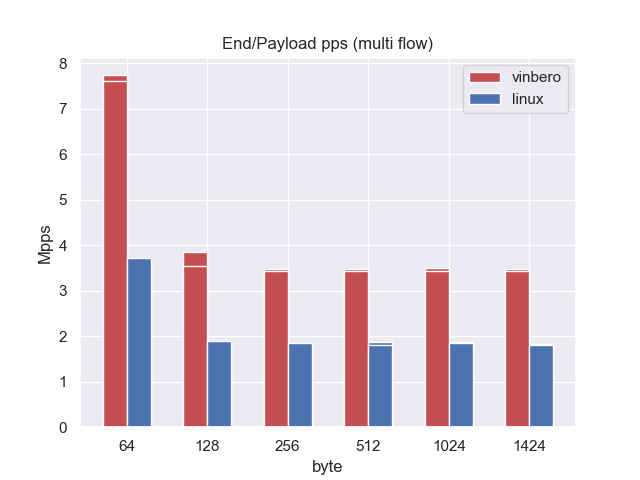
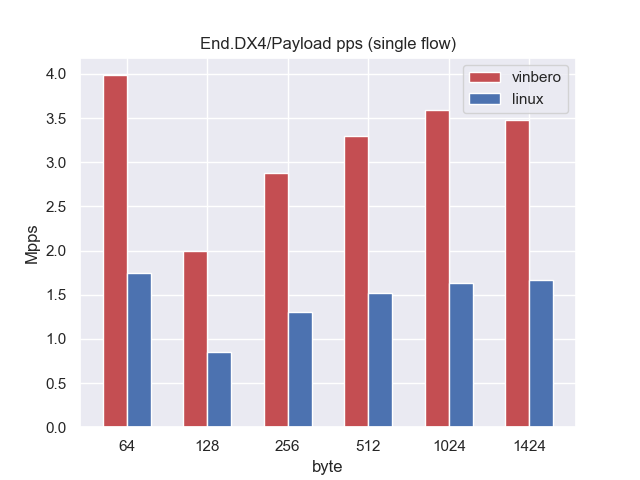
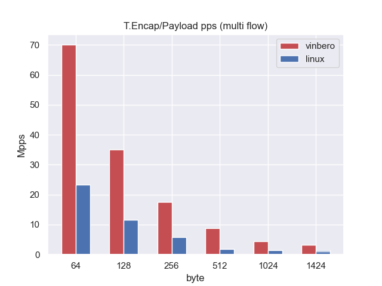

# Performance

Using Trex to measure communication speed


**The result is about 3-5Mpps in single flow, which is 2-3 times better performance than linux!**

## Install
in detel to check link
cf. [https://trex-tgn.cisco.com/trex/doc/trex_manual.html](https://trex-tgn.cisco.com/trex/doc/trex_manual.html)

This time I am using fedora33 and mellanox X5 EN 50GbE.
However, fedora33 is trapped by the validation of the mellanox driver installation, so we need to do a work-around hack!

```
yum -y install perl-File-Tail perl-File-Copy perl-File-Compare perl-sigtrap
yum -y install kernel-rpm-macros python-srpm-macros rpm-build python3-devel tk gcc-gfortran tcsh elfutils-libelf-devel
wget http://www.mellanox.com/downloads/ofed/MLNX_OFED-5.2-1.0.4.0/MLNX_OFED_LINUX-5.2-1.0.4.0-fc32-x86_64.tgz
tar xfvz MLNX_OFED_LINUX-5.2-1.0.4.0-fc32-x86_64.tgz
cd　MLNX_OFED_LINUX-5.2-1.0.4.0-fc32-x86_64/
```

`mlnxofedinstall` check and rewrite

```
} elsif ($dist_rpm =~ /fedora-release(|-common)-(\d+)/ and
        ($2 >= 12) and ($2 <= 33)) {
```

lets install
```
./mlnxofedinstall --add-kernel-support --distro fc32
# reboot after run
/etc/init.d/openibd restart
```

next, trex install
```
sudo su -
mkdir -p /opt/trex
cd /opt/trex
wget --no-check-certificate --no-cache https://trex-tgn.cisco.com/trex/release/v2.87.tar.gz
cd /opt/trex
tar xzvf v2.87.tar.gz
cd /opt/trex/v2.87
```

## Usage
```
./t-rex-64 -i

# Open another console
./trex-console
start -f ./workspace/srv6_end_m_gtp4_e_for_range_clients.py -t packet_len=64 --port 0 -m 100%
```

## RouterSetup
use irqaffinity. this mellanox nic case.

```
git clone https://github.com/Mellanox/mlnx-tools.git
cd mlnx-tools/
./set_irq_affinity.sh ens4f0np0 ens4f1np1
```

## linux SRv6 conifg
```
ip sr tunsrc set fc00:2::2
systemctl stop firewalld
systemctl disable firewalld

ip neigh add 10.1.0.1 lladdr 0c:42:a1:8e:8d:26 dev ens4f0
ip neigh add 10.2.0.1 lladdr 0c:42:a1:8e:8d:27 dev ens4f1
ip neigh add fc00:12::1 lladdr 0c:42:a1:8e:8d:26 dev ens4f0
ip neigh add fc00:21::1 lladdr 0c:42:a1:8e:8d:27 dev ens4f1

sudo sysctl -w net.ipv6.conf.ens4f0.seg6_enabled=1

# end
sudo ip -6 route add fc00:2::2/128 encap seg6local action End dev ens4f0

# encap
sudo ip route add 10.2.0.1/32 encap seg6 mode encap segs fc00:3::3 dev ens4f0

# dx4
sudo ip -6 route del fc00:2::2
sudo ip -6 route add fc00:2::2/128 encap seg6local action End.DX4 nh4 10.2.0.2 dev ens4f0
```

## Results
### Mobile v4


### End



### End.DX4



### T.Encap




## Memo
Probably because RSS is not working for SRv6 in my measurement environment, and only encap is showing performance.
I want to investigate how to enable RSS for SRv6....

## Reference
* https://github.com/tohojo/xdp-paper/blob/master/benchmarks/bench01_baseline.org

